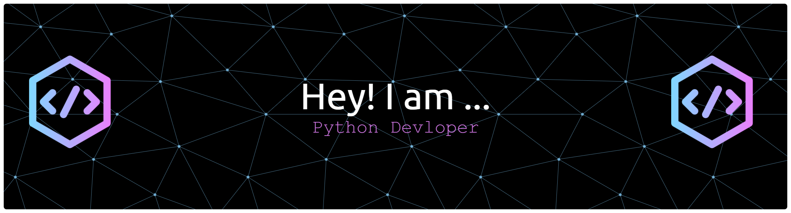

<!-- Banner -->

  

<!-- Typing SVG -->

  

---

## 🧑‍💻 About Me  
- 🎓 B.Tech in *Artificial Intelligence & Machine Learning* @ G.H. Raisoni College of Engineering, Pune  
- 💡 Passionate about *Machine Learning, Web Development, and Data Structures & Algorithms*  
- 🚀 Exploring *Full-Stack Development + AI-driven Systems*  
- 🏆 Active on [LeetCode](https://leetcode.com/u/varun_1/) & coding contests  
- 📬 Reach me: *varunkale1829@gmail.com*

---

## ⚙ Tech Stack  

  <!-- Languages -->
  

---

## 🔥 Projects Showcase  

🚀 *Great Cart* – Full-stack E-commerce platform with *Django + SQL*  
🚀 *StockSmart* – Smart inventory system with *React, Django & ML algorithms*  

---

## 📊 GitHub Stats (Hacker Mode)  

  
  

---

## 📂 My Repositories & Languages  

  

---

## ⚡ Activity Graph  

  

---

  

